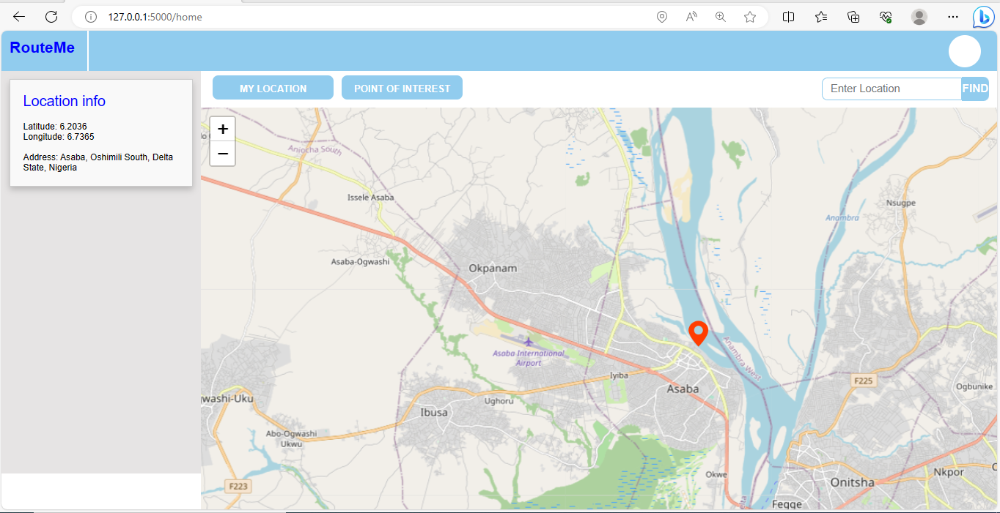
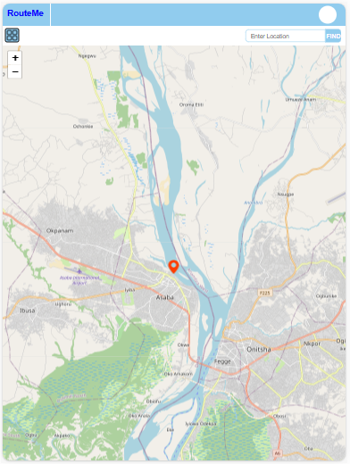
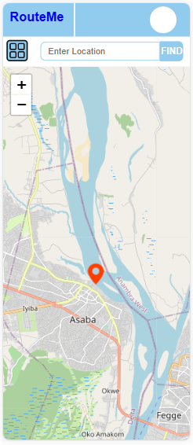

# RouteME

A geolocation web app.


 

## Table of Contents

- [Project Name](#project-name)
- [Table of Contents](#table-of-contents)
- [Introduction](#introduction)
- [Demo](#demo)
- [Features](#features)
- [Installation](#installation)
- [Usage](#usage)
- [Technology Used](#technology-used)
- [Contributing](contributing)
- [Authors](#authors)
- [Acknowledgement](#acknowledgement)
- [License](#license)

## Introduction

Welcome to Routeme a versatile geolocation web applicaton. RouteMe is a Project initiated to help commutters navigate their environment and get info location update about their current location or any location of their choice. Routeme web application provides realtime location tracking of users, location search and also gives capability to get information about amenities that are available within aspecific geographical environment. 
To use this application user must grant permission access to the application and make sure that location feature is enabled on their device. RouteMe has been tested on all devices and web browsers that supports geolocation navigation, and it has been observed that location accuracy is more on mobile device because of the . it is a responsive and seamless application that makes navigation both on mobile device and desktop system simple and interactive.

 the user friendly interface enable seamless navigation.
- webapp url - https://provoleaning.tech/route-me
- blog articles
  - blog1
  - blog2
  - blog3
- authors Linkedln
  - https://www.linkedin.com/in/desolution01
  - https://www.linkedin.com/in/chiamaka-nwobodo-476a44191/
  - https://www.linkedin.com/in/iyenoma-provo-6b633516a/

## Demo

- open any browser of your choice preferably on phone to get accurrate location.
- enable location on you phone or pc. and make sure you grant location access when asked by your device
- click the link https://provolearning.tech/route-me or enter it in your opened browser 

## Features

- `My location`: shows user current location on the map
- `point of interest`: show marker of place of intrest on your current location
- `search box`: seach for any specific location on the map

## Installation

1. clone the repository

```bash
root> _
root> git clone https://github.com/Zuribaby/alx-route-me.git
...

```
2. change directory to the cloned repository

```bash
root> cd alx-route-me
```
3. install dependencies

```bash
#get update for you linux machine
root/alx-route-me> sudo apt-get update
...
#install python3
root/alx-route-me> sudo app-get install python3
...

#install pip
root/alx-route-me> sudo app-get install python3-pip
...

#install flask
root/alx-route-me> pip3 install python3-flask

#install Node.js and npm
root/alx-route-me> pip3 install node.js npm
...

#install gunicorn 
root/alx-route-me> pip3 install gunicorn
...

```
4. generate self signed ssl certificate

```bash
#ckeck if Openssl is installed or isntall if not
root/alx-route-me> openssl --version
...

root/alx-route-me> sudo apt-get install openssl
...

#Generate a Private Key
root/alx-route-me> openssl genpkey -algorithm RSA -out private.key
...

#Generate a Certificate Signing Request
root/alx-route-me> openssl req -new -key private.key -out certificate.csr
...

#Generate self signed certificate
root/alx-route-me> openssl x509 -req -in certificate.csr -signkey private.key -out certificate.crt
...

```
`Note:` follow installation processes and provide necessary information amd permissions.

## Usage 

```bash
root/alx-route-me>gunicorn -b 0.0.0.0:443 --certfile=/path/to/certificate.crt --keyfile=/path/to/private.key app:app
... 
#your https server will start 
#use the url provided by the server
```

## Technology Used

- Python 3.9.0
- Flask 2.3.2
- HTML/CSS
- JavaScript

## Contributing

We welcome contributions from the community! To contribute to this project, please follow these guidelines:

### Reporting Issues

If you encounter any issues with the project or have a feature request, please check our [Issue Tracker](https://github.com/Zuribaby/alx-route-me/issues) to see if a similar issue has already been reported. If not, feel free to open a new issue. When creating an issue, please provide the following information:

- A clear and concise title
- A detailed description of the issue or feature request
- Steps to reproduce (if applicable)
- Your environment (e.g., operating system, browser version)

### Submitting Pull Requests

If you'd like to contribute code to the project, we encourage you to submit a Pull Request (PR). Follow these steps:

1. Fork the project repository to your GitHub account.
2. Create a new branch for your changes: `git checkout -b feature/your-feature-name`
3. Make your changes, adhering to our coding standards (see below).
4. Commit your changes with clear, concise messages.
5. Push your branch to your fork: `git push origin feature/your-feature-name`
6. Open a Pull Request against the `main` branch of this repository.
7. Provide a clear title and description of your changes in the PR.
8. Be prepared to address any feedback or questions during the review process.

### Coding Standards

We follow a set of coding standards to maintain code consistency and readability. Please ensure that your code adheres to the following guidelines:

- Use meaningful variable and function names.
- Follow the existing code style, including indentation and formatting.
- Include comments when necessary to explain complex logic or unusual approaches.
- Write clear commit messages in the present tense.

By contributing to this project, you agree that your code will be licensed under the project's [License](#license).

Thanks.

## Authors

[Chiamaka Nwobodo](https://github.com/Zuribaby)
  [](https://github.com/Zuribaby)
  [](https://www.linkedin.com/in/chiamaka-nwobodo-476a44191/)

[Aanuoluwapo Shodipo](https://github.com/Desolution01)
  [](https://github.com/Desolution01)
  [](https://www.linkedin.com/in/desolution01)

[Provo Iyenoma](https://github.com/Provoski)
  [](https://github.com/Provoski)
  [](https://www.linkedin.com/in/iyenoma-provo-6b633516a)

## Acknowledgement
We would like to extend our thanks to the following resources for their contributions and support in the development of this project:

- **ALX-SE** - a big thank you to ALX-SE community for providing the platform and tools needed to achieve this milestone 
- **OpenStreetMap** - We are grateful for to OpenStreetMap open source community for providing API, frameworks, and tools that made this project possible.
- **Stack Overflow** - The Stack Overflow community has been instrumental in helping us overcome technical challenges.
- **GitHub** - Making collaboration and version control seamless.
- **Chatgpt** - Helped reduced time that would otherwise be wasted for code debugging. 

## License
This project is licensed under [Apache License 2.0](LICENSE) - see the [LICENSE](LICENSE) file for details.